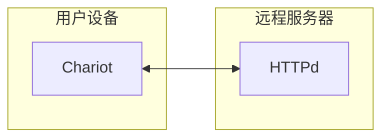
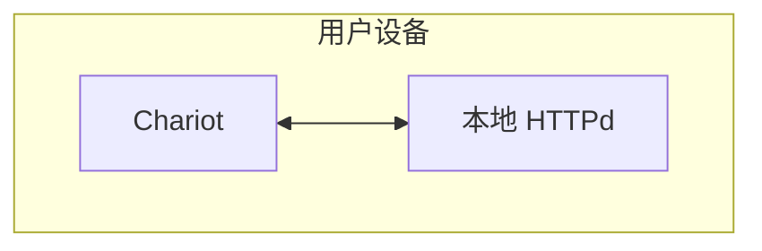
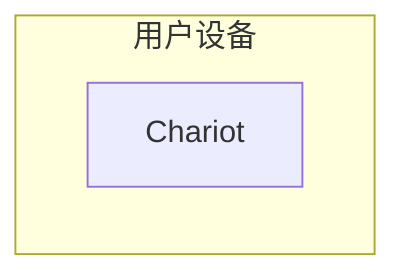

# 应用类型 {#project-types}

## 全部后端，远程HTTPD
此种模式下，和浏览器没什么区别，所有的代码都在后端。
同时也可以通过JSAPI提供扩展的功能，可以看成是一个扩展后的网页浏览器。
这是最传统的模式。

这里有一个简单的例子。

## 前后端分离，本地HTTPD
前后端分离，Chariot会启动一个本地httpd服务器（端口随机）供前端使用。前端通过API接口与后端通信。
这是目前主流的web应用模式。

这里有一个简单的例子。

## 静态H5，无HTTPD
静态H5，无需网络，所有的业务逻辑都由本地 H5 来实现

这里有一个简单的例子

# 更多的例子
例子1
例子2
例子3
例子4
例子5
例子6

.
├─ docs
│  ├─ .vitepress
│  │  └─ config.js
│  ├─ api-examples.md
│  ├─ markdown-examples.md
│  └─ index.md
└─ package.json

| Syntax      | Description | Test Text     |
| :---        |    :----:   |          ---: |
| core      | Title       | Here's this   |
| Paragraph   | Text        | And more      |

***请注意：***

所有的JS调用皆为异步，其返回值皆为 Promise。

下列文档中提到的返回值皆为 Promise 回调接收到的值。

下列文档中的示例，皆以 await 作为例子，可以复制到浏览器devtool中的主控台运行。